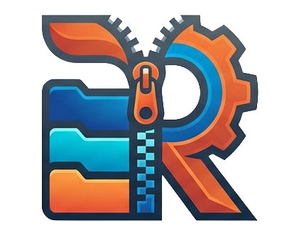
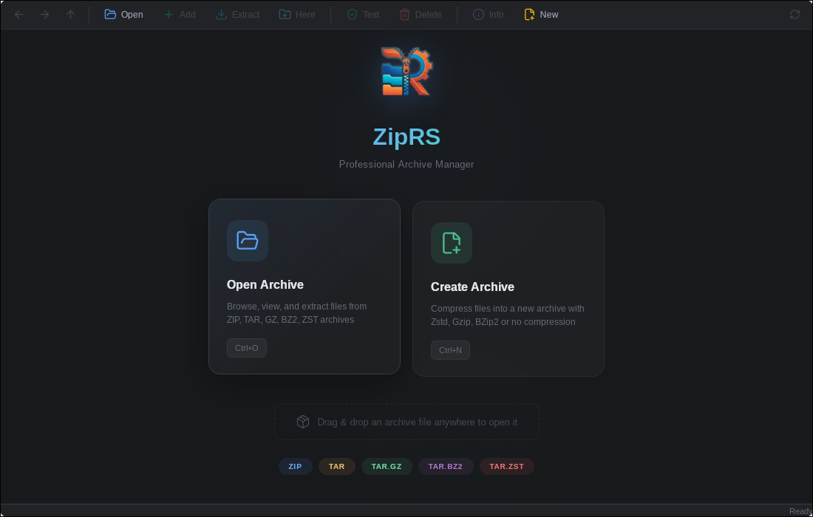

<p align="center">
  
</p>

<h1 align="center">ZipRS</h1>

<p align="center">
  <strong>A fast, modern archive manager built with Rust</strong>
</p>

<p align="center">
  
  
  
  
  
</p>

---

<p align="center">
  
</p>

## About

ZipRS is a professional desktop archive manager inspired by WinRAR, built entirely in Rust for maximum performance. It features a modern dark UI powered by Tauri v2, Svelte 5, and TailwindCSS 4.

## Features

- **Multi-format support** — ZIP, TAR, TAR.GZ, TAR.BZ2, TAR.ZST
- **Full archive operations** — Open, browse, extract, add, delete, create, test
- **ZIP with Zstd compression** — Level 19 for maximum compression ratio
- **Folder navigation** — Breadcrumb address bar with back/forward/up history
- **File table** — Sortable columns, multi-select (Ctrl+Click, Shift+Click), colored file-type icons
- **Drag & drop** — Drop archives onto the window to open them
- **Drag out** — Extract files by dragging them out to your file manager via ripdrag
- **Context menu** — Right-click for quick actions on selected entries
- **Keyboard shortcuts** — Ctrl+O, Ctrl+N, Ctrl+E, Ctrl+T, Delete, F5, and more
- **Progress tracking** — Real-time progress bar for all archive operations
- **Properties panel** — Detailed file info including CRC-32, compression ratio, method
- **Integrity testing** — Verify archive contents with one click
- **Native performance** — Rust backend with async operations via Tokio

## Supported Formats

| Format | Browse | Extract | Add/Delete | Create |
|--------|--------|---------|------------|--------|
| ZIP | Yes | Yes | Yes | Yes |
| TAR | Yes | Yes | No | Yes |
| TAR.GZ | Yes | Yes | No | Yes |
| TAR.BZ2 | Yes | Yes | No | Yes |
| TAR.ZST | Yes | Yes | No | Yes |

## Requirements

- **Rust** 1.75+
- **Node.js** 18+
- **System dependencies** (Linux):
  ```
  webkit2gtk-4.1 libgtk-3-dev libayatana-appindicator3-dev librsvg2-dev
  ```
- **Optional**: [ripdrag](https://github.com/nik012003/ripdrag) for drag-out extraction

## Building

```bash
# Install frontend dependencies
npm install

# Run in development mode
cargo tauri dev

# Build for production
cargo tauri build
```

## Keyboard Shortcuts

| Shortcut | Action |
|----------|--------|
| `Ctrl+O` | Open archive |
| `Ctrl+N` | Create new archive |
| `Ctrl+E` | Extract all |
| `Ctrl+H` | Extract here |
| `Ctrl+T` | Test archive integrity |
| `Ctrl+A` | Select all |
| `Delete` | Delete selected entries |
| `Enter` | Open file / Navigate into folder |
| `Backspace` | Navigate up |
| `Alt+Left/Right` | Navigate back/forward |
| `Alt+Enter` | Properties |
| `F5` | Refresh |

## Architecture

```
ZipRS/
├── src-tauri/           # Rust backend (Tauri v2)
│   └── src/
│       ├── main.rs      # Entry point
│       ├── lib.rs       # Tauri builder & plugin registration
│       ├── commands.rs   # Tauri IPC command handlers
│       ├── progress.rs   # Progress event emitter
│       └── archive/      # Archive backend implementations
│           ├── mod.rs    # ArchiveBackend trait & format detection
│           ├── entry.rs  # ArchiveEntry data model
│           ├── zip_backend.rs  # ZIP operations (Zstd level 19)
│           └── tar_backend.rs  # TAR/GZ/BZ2/ZST operations
├── src/                 # Svelte 5 frontend
│   ├── App.svelte       # Main app component
│   ├── app.css          # Global styles & CSS variables
│   ├── main.ts          # Svelte mount
│   └── lib/
│       ├── store.svelte.ts  # Reactive state (Svelte 5 runes)
│       ├── types.ts     # TypeScript interfaces
│       ├── utils.ts     # Formatting utilities
│       └── components/  # UI components
└── static/              # Static assets (logo)
```

## Tech Stack

- **Backend**: Rust, Tauri v2, Tokio, zip, tar, flate2, bzip2, zstd
- **Frontend**: Svelte 5, TailwindCSS 4, Lucide icons, TypeScript
- **Build**: Vite 7, Tauri CLI

## License

MIT
